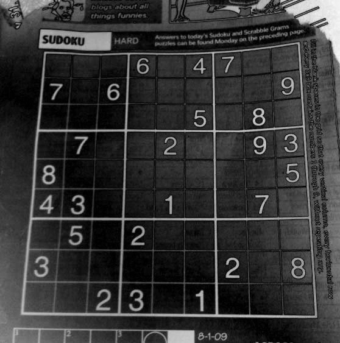

# DIP Project 1 Report

## Project Content

This project involves two main tasks: image enhancement using frequency domain filtering and noise removal using morphological operations.

## Method Description

### 1. Image Enhancement

For image enhancement, we used a high-pass filter in the frequency domain to sharpen the image and highlight edges and details. The high-pass filter was applied to the image `sudoku.png`.

### 2. Morphology

For noise removal, we used morphological operations. Specifically, we applied erosion followed by dilation to remove noise from the image `resized_zzz.png`. The erosion operation removes small noise points, and the dilation operation restores the main structures of the image.

## Experiment Results and Analysis

### 1. Image Enhancement

**Original Image:**

**Processed Image:**

The high-pass filter effectively sharpened the image, highlighting the edges and details.

### 2. Morphology

**Original Image:**

**Processed Image:**

The morphological operations successfully removed the noise while preserving the main structures of the image.

## Summary

In this project, we implemented image enhancement using a high-pass filter and noise removal using morphological operations. Both methods effectively achieved the desired results, demonstrating the power of frequency domain filtering and morphological processing in image processing tasks.
